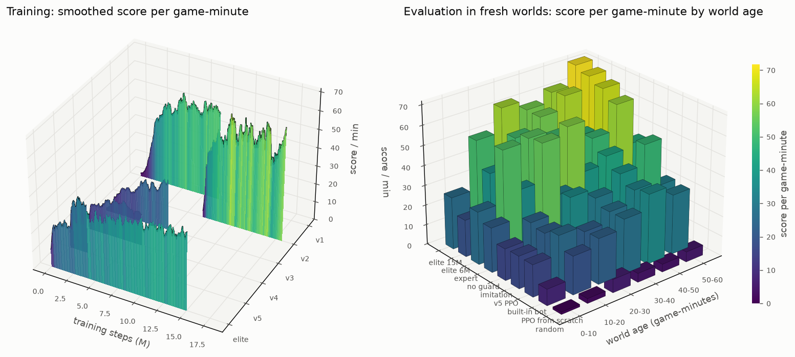

# mk48

mk48 neural network on mac

This is [mk48](https://github.com/SoftbearStudios/mk48), a free online naval combat game by
Softbear (open source, AGPL-3.0), plus **AI players that taught themselves to play it** using neural
networks, trained on a private copy of the game running on a Mac.

The best AI, **NN Elite**, compared with the bots that come with the game, scores about **2× the
points**, sinks about **7× as many ships**, and gets sunk about **half as often**.

- **[agent/README.md](agent/README.md):** how it works, explained simply (no AI background
  needed), with pictures and how to play against the AI or watch through its eyes.
- **[agent/TECHNICAL.md](agent/TECHNICAL.md):** the full technical details.



What was added to the game itself:

- **Training mode:** the game runs without graphics, as fast as the computer allows, so the AI can
  practice millions of times (`server/src/train.rs`).
- **AI bots in the real game:** players named "NN 1", "NN 2"… are driven by the neural network,
  and naming yourself "AI" lets the AI drive your ship (`server/src/nn_bots.rs`).
- **A safety reflex** that keeps AI ships from crashing into oil platforms and land.
- **A scoreboard that shows everyone**, bots included (`server/src/server.rs` and the engine copy
  in `vendor/kodiak`).

Nothing here connects to mk48.io or any public server.

---

*The original mk48 README follows.*

# Mk48.io Game

[](https://github.com/SoftbearStudios/mk48/actions/workflows/build.yml)
<a href='https://discord.gg/YMheuFQWTX'>
  
</a>


[Mk48.io](https://mk48.io) is an online multiplayer naval combat game, in which you take command of a ship and sail your way to victory. Watch out for torpedoes!

- [Ship Suggestions](https://github.com/SoftbearStudios/mk48/discussions/132)

## Build Instructions

1. Install `rustup` ([see instructions here](https://rustup.rs/))
2. Install `gmake` and `gcc` if they are not already installed.
3. Install trunk, Rust Nightly, and the WebAssembly target

```console
make rustup
make trunk
```

4. Build client

```console
cd client
make release
```

5. Build and run server

```console
cd server
make run_release
```

6. Navigate to `https://localhost:8443/` and play!

## Developing

If you follow the *Building* steps, you have a fully functioning game (could be used to host a private server). If your goal
is to modify the game, you may want to read more :)

### Entity data

Entities (ships, weapons, aircraft, collectibles, obstacles, decoys, etc.) are defined at the bottom of
`common/src/entity/_type.rs`.

### Entity textures

Each entity type must be accompanied by a texture of the same name in the spritesheet, which comes with the
repository. If entity textures need to be changed, see instructions in the `sprite_sheet_packer` directory.

## Contributing
See [Contributing](https://github.com/SoftbearStudios/mk48/wiki/Contributing) Wiki page.

## Trademark

Mk48.io is a trademark of Softbear, Inc.
