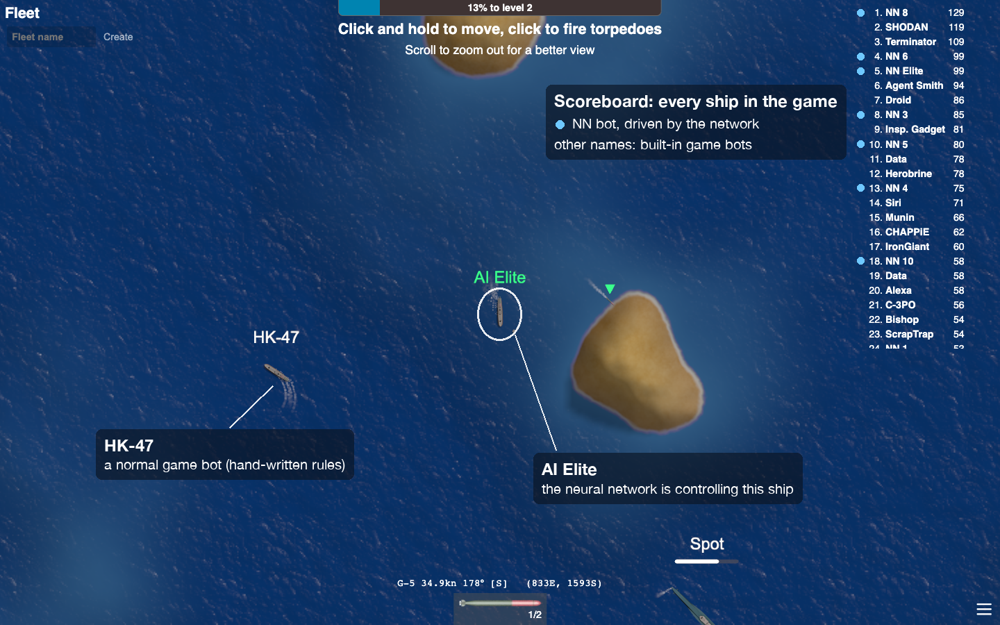
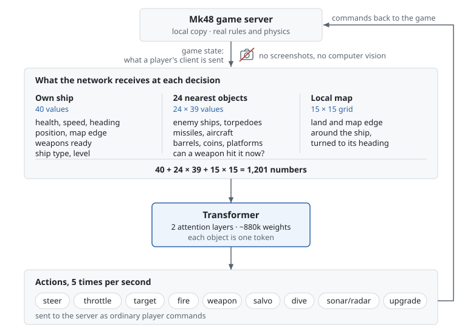
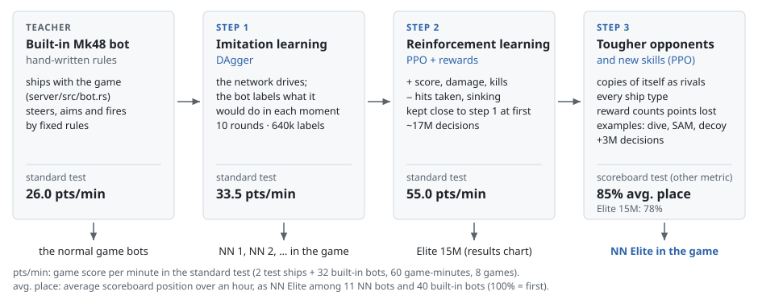
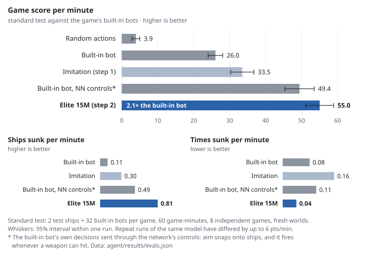

# Teaching a Neural Network to Play Mk48

I modified a local copy of the open-source naval game [Mk48.io](https://github.com/SoftbearStudios/mk48) so that
ships controlled by a neural network could train in it and then play in the real game. The network reads the game
state as numbers. It never sees the screen.



The game running on my machine. The ship in the centre is a player I named `AI Elite`: the server hands players
with that name to the elite network, so the browser only shows what the network is doing. On the scoreboard,
NN 1, NN 2, … and NN Elite are bots driven by the network. Every other name is one of the game's built-in bots.

## What I built

- A headless training mode for the game server: the same world simulation with no graphics, networking or
  real-time clock (`server/src/train.rs`). The elite's 15M training decisions took about 4 hours; one ship
  playing in real time, at 5 decisions per second, would need about 35 days.
- A transformer policy (~880k weights, PyTorch) trained in three steps: copying the built-in bot,
  reinforcement learning with PPO, then fine-tuning against copies of itself (`agent/`).
- NN bots in the playable game. The server can hand any bot, or any player whose name starts with `AI`, to the
  network (`server/src/nn_bots.rs`). Those ships play under the same rules as human players.
- An evaluation harness that drops a model into fresh games against the built-in bots and records score, kills,
  deaths and scoreboard position (`agent/evaluate.py`, `agent/pressure_test.py`).

Everything runs locally. Nothing in this repository connects to, or plays on, the public mk48.io servers.

## How it works

<picture>
  <source media="(prefers-color-scheme: dark)" srcset="agent/figures/overview-dark.svg">
  
</picture>

Five times per game-second, the server takes what it would send that ship's player and encodes it as 1,201
numbers: 40 about the ship itself, 39 for each of the 24 nearest objects (ships, torpedoes, missiles, aircraft,
barrels, oil platforms) and a 15 × 15 grid of land around it. Each object becomes one token for a small
transformer, which compares the objects with each other, for example to decide which enemy to aim at. The
network outputs one choice per control: heading, throttle, which object to target (or none), whether to fire
and with which weapon, whether to dive, and whether sonar/radar is on. The server applies that as an ordinary
player command.

There are no images anywhere in the input. The only convolution in the model runs over the 15 × 15 land grid,
which comes from the map data.

## How it learned

<picture>
  <source media="(prefers-color-scheme: dark)" srcset="agent/figures/training_pipeline-dark.svg">
  
</picture>

The built-in Mk48 bot is a set of hand-written rules (`server/src/bot.rs`). It isn't strong, but it plays a
complete game, so I used it as the teacher.

1. **Imitation (DAgger).** Each training ship has a hidden copy of the bot that reports, at every step, what it
   would do from that ship's view. The network drives and is trained to match those labels, so it also gets
   labels for the situations its own mistakes lead to. After 10 rounds (640k labelled decisions) it scored 33.5
   points per minute against the bot's 26.0. The labels use the bot's firing solution rather than its trigger,
   which fires at partly random moments.
2. **Reinforcement learning (PPO).** Starting from the imitation weights, the network plays on its own and is
   trained on a reward: plus for score, damage dealt and kills, minus for damage taken and sinking. A KL penalty
   keeps it close to the imitation policy at first; an earlier run without it drifted away from what it had
   copied and got worse. The final run, Elite 15M, also had a salvo action and frozen imitation bots as
   opponents.
3. **Tougher opponents and new skills.** Elite 15M did well in tests but sat lower on the real scoreboard, where
   sinking wipes about 40% of your score. I fine-tuned it for 3M more decisions against copies of itself, in
   every ship type, with a reward that charges for the points a death actually costs, plus small imitation
   "lessons" for moves PPO almost never tried: diving, firing a SAM at an incoming missile, launching a decoy at
   a torpedo. The result drives NN Elite in the game.

The reward is only used for training. The results below use the game's own score or the scoreboard position.

## Results

<picture>
  <source media="(prefers-color-scheme: dark)" srcset="agent/figures/results-dark.svg">
  
</picture>

Each model plays fresh games with 2 test ships and 32 built-in bots per game, for 60 game-minutes, in 8 separate
games (`agent/evaluate.py`; raw numbers in [`agent/results/evals.json`](agent/results/evals.json)).

Compared with the built-in bot, Elite 15M scored 2.1× as many points per minute (55.0 vs 26.0). Over the same
960 ship-minutes it sank 780 ships against the bot's 102 and was sunk 41 times against 81. That is a
kills-per-death ratio of 19 against 1.3, but with only 41 deaths the ratio is noisy: three tests of the 6M
checkpoint gave 12.9, 14.8 and 24.3.

Part of the gap comes from the controls, not from learning. When the bot's own decisions go through the
network's control interface (aim snaps onto the target, and it fires whenever a weapon can hit), it already
scores 49.4. Against that version the network's advantage is mostly in combat: 1.7× the kills and 0.4× the
deaths per minute.

The ship called NN Elite in the game is Elite 15M after step 3. I tested it on the scoreboard instead. In the
game's setup (NN Elite, 11 other NN bots and 40 built-in bots, 60 minutes, 8 games), its average position went
from 78% to 85% (100% = first place; two separate runs both gave 85%), and 93% after the first 20 minutes. My target was 90%
over the whole hour. It misses that because everyone starts at zero and the smallest boats score very little.

All comparisons are against the game's bots, not human players. Repeating the same test has moved a model's score
by up to 6 points per minute, so I only compare models tested in the same batch when choosing between them.

## What the network learned, and what I added by hand

Measured with `agent/skills.py` (32 ships of every type, 30 game-minutes), which counts how often each weapon is
used in the situations it exists for:

- **Diving.** Submarines driven by NN Elite stay submerged 91% of the time, 95% when a threat is near. Elite
  15M never dived.
- **SAMs.** It fires an anti-air missile at 63% of the incoming missiles and aircraft it could hit (Elite 15M: 5%).
- **Decoys.** It launches a decoy at 26% of closing torpedoes and missiles (Elite 15M: never). Diving, SAMs and
  decoys all needed the step-3 lessons; PPO alone almost never tried them.
- **A different fight per ship.** The ship type is one of the inputs. In the standard test the Skjold and Buyan
  missile boats fired 91% missiles, the Montana battleship 82% guns, and the Fletcher destroyer split 64/18/18
  between torpedoes, guns and depth charges.
- **Protecting a lead.** After the step-3 reward change, deaths in the scoreboard test fell from 0.087 to 0.040
  per minute, and from 0.108 to 0.075 per minute against bots set to double aggression.

Some behaviour is fixed code in `server/src/train.rs`, not the network:

- **Aiming ahead.** The network picks the target and when to fire. The aim point is then moved to where a moving
  ship will be when the shot arrives. In the same test this gave 18% more damage and 16% more kills.
- **Collision guard.** If the ship is about to hit land, an oil platform or the map edge, it takes the nearest
  clear heading. In one test, 81 of 140 deaths were navigation deaths without the guard and 3 with it.
- **Ship personas.** Each NN ship draws random preferences every life (submarine captain, carrier admiral, …),
  so NN bots take different upgrade paths. Left to itself, the network always upgraded to surface ships.

## Try it

macOS or Linux. Build once (the server embeds the web client, so build the client first):

```bash
rustup toolchain install nightly-2024-04-20 && rustup override set nightly-2024-04-20
rustup target add wasm32-unknown-unknown
cargo install --locked trunk --version 0.21.7
(cd client && trunk build --release --minify --no-sri --skip-version-check --filehash false)
(cd server && cargo build --release)

cd agent
uv venv --python 3.12 .venv
uv pip install --python .venv/bin/python torch gymnasium stable-baselines3 numpy tensorboard matplotlib pytest
```

Then, from `agent/`, start a game with 12 NN bots (the last one is NN Elite) and 40 built-in bots:

```bash
./run_game.sh models/bc_v6.pt 12 40 models/elite_v2b_3M.pt
```

Open https://localhost:8443 and accept the certificate warning (it's your own server). Enter `AI Elite` as your
name to watch the elite play, or any other name to play against the bots. More options are in
[agent/README.md](agent/README.md).

## Technical details

[agent/TECHNICAL.md](agent/TECHNICAL.md) covers the observation and action encoding, the architecture, every
evaluation table, the training commands, diagnostic plots and what didn't work. [agent/README.md](agent/README.md)
lists the models and what each file does. The figures on this page are generated by
[`agent/plot_readme.py`](agent/plot_readme.py) from the result files.

## Original Mk48 and attribution

Mk48.io is an online naval combat game made by [Softbear](https://github.com/SoftbearStudios). This repository is
a fork of [SoftbearStudios/mk48](https://github.com/SoftbearStudios/mk48), imported at commit `277fa87`, with
Softbear's Kodiak engine vendored in `vendor/kodiak`. The game, its art and its engine are their work. My
additions are `agent/`, the training and NN-bot code in `server/src/` (`train.rs`, `nn_bots.rs` and smaller
changes to existing server files) and a scoreboard change in the vendored engine.

The game is licensed under [AGPL-3.0](LICENSE) and the engine under [LGPL-3.0](vendor/kodiak/LICENSE); this fork
keeps those licenses. For the original project and its build instructions, see the
[upstream README](https://github.com/SoftbearStudios/mk48#readme).

Mk48.io is a trademark of Softbear, Inc. This project is not affiliated with or endorsed by Softbear.
