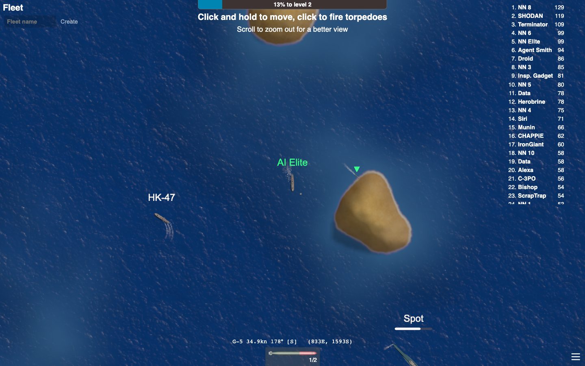

# Teaching an AI to play mk48

This folder contains AI players ("bots") that learned to play **mk48**, a free online game where
you captain a warship. They use **neural networks**, the same basic technology behind image
recognition and chatbots. This page explains what we built and how it works, without assuming you
know any AI.

*Want the code-level details? See [TECHNICAL.md](TECHNICAL.md).*



*The real game running on this computer. The ship in the middle, "AI Elite", is being driven by the
neural network. The list on the right is the scoreboard: the AI bots are named "NN 1", "NN 2",
and so on.*

---

## The short version

- **The game:** you sail a ship, pick up barrels and coins for points, and fight other ships with
  torpedoes, guns, missiles and more. More points let you upgrade to bigger ships.
- **What we built:** AI bots that look at the game and decide what to do 5 times a second,
  completely on their own.
- **The result:** the best bot, **NN Elite**, compared with the bots that come with the game:
  - scores about **2× as many points** (55 vs 26 per minute);
  - sinks about **7× as many ships** (one every ~75 seconds vs one every ~9 minutes);
  - gets sunk only about **half as often**.
- **Safe and fair:** everything runs on your own computer, on a private copy of the game. The bots
  never play on the public mk48 servers.

---

## Try it yourself

You need a Mac or Linux computer. The one-time setup builds the game and installs the AI tools;
the steps are in **[Setup](#setup-once)** below.

Then start the game with AI bots (from this `agent` folder):

```bash
./run_game.sh models/bc_v6.pt 12 40 models/elite_15M.pt
```

That means: 12 AI bots (the last one is the elite) and 40 of the game's normal bots. Then:

1. Open **https://localhost:8443** in Chrome or Safari. Your browser will warn that the connection
   isn't private. That's because your own computer is the server. Click "Advanced" and continue.
2. Type a name and press Play:
   - **`AI Elite`**: the elite AI drives your ship and you watch through its eyes.
   - **`AI`**: a regular AI bot drives your ship.
   - **anything else**: you play yourself and fight the AI bots. Hold the mouse button to steer,
     click to fire, press 1–9 to pick a weapon, R to dive with a submarine, and scroll to zoom.
3. To stop the game, press **Ctrl+C** in the terminal where it's running.

---

## How does the AI "see" the game?

You see the game as pictures on a screen. The AI gets the same information, but as a list of
numbers, **1,201 numbers** every time it decides. It only gets what a human player could see, not
hidden information.

- **About its own ship:** health, speed, direction, position, which weapons are loaded, what type
  of ship it is, and so on.
- **About the 24 closest things it can see** (enemy ships, torpedoes heading its way, barrels,
  oil platforms…): where each one is, how fast it's moving, what kind of thing it is, and whether
  a loaded weapon could hit it right now.
- **A small map** of the land and sea around the ship, so it doesn't run aground.

## How does it decide what to do?

Five times a second, the AI makes a set of choices, the same controls a human player has:

| Choice | Options |
|---|---|
| Steer | 16 directions (like points on a compass) |
| Speed | 5 settings, from reverse to full speed |
| Target | which of the visible ships or torpedoes to aim at (or none) |
| Fire? | yes or no |
| Which weapon | torpedo, gun, missile, aircraft, depth charge, anti-air missile, decoy |
| Salvo? | fire every weapon that can hit the target, all at once (elite only) |
| Dive? | for submarines |
| Sonar/radar on? | finds enemies better, but also gives away your position |
| Next ship | which kind of ship to upgrade to |

## What is a neural network, really?

A neural network is a **very big math formula** with lots of adjustable numbers in it, called
**weights**. Ours has about **880,000** of them. Numbers go in (the 1,201 things it sees), the
formula mixes them together in many layers, and numbers come out (its choices).

At first, the weights are random, so the choices are random. The ship just wanders around, about
as badly as pressing random buttons (that scores about 4 points per minute). **Training** means slowly adjusting the weights until
the formula gives good choices. Nobody writes rules like "turn left when a torpedo comes". The
network has to discover them from experience.

Our network is a type called a **transformer**, the same building block used in chatbots. It treats
every ship, torpedo and barrel it sees as a separate item and compares them all with each other.
That's how it can figure out things like "that destroyer is the biggest threat, but this small
boat is the easiest target".

---

## How it learned, in four steps

Learning to play is a bit like learning a sport. Here's what happened.

### Step 1: A practice field that runs super fast

Playing the real game in a browser, a bot can make about 10 decisions per second. That's far too
slow, because a neural network needs *millions* of practice decisions. So we added a special
**training mode** to the game: the same rules and physics, but no graphics, running as fast as the
computer can. It makes about **18,000 decisions per second**, and up to 64 ships learn at the same
time.

The final elite practiced for **15 million decisions**. That's about **35 days of nonstop play**,
squeezed into about **4 hours**.

### Step 2: Copying a teacher (imitation learning)

The game already comes with simple computer bots, written by hand by the game's creators. We
used one as a **teacher**:

1. The AI plays the game.
2. In every situation, the teacher bot is asked: "What would *you* do right now?"
3. The AI adjusts its weights to make its own choice closer to the teacher's.

It's like learning tennis by playing while a coach shouts "move left!" whenever you're out of
position. The AI was the one driving, so it also learned how to recover from its *own* mistakes.
(The fancy name for this method is **DAgger**.) After about 640,000 coached moments, it played a
little better than its teacher (34 vs about 26 points per minute).

### Step 3: Practice with a score (reinforcement learning)

Copying only makes you as good as your teacher. To get *better*, the AI then played on its own,
earning and losing **reward points**:

- ✅ points for collecting barrels and coins, damaging enemies and sinking ships;
- ❌ points taken away for being hit and for sinking.

After each round of practice, it nudges its weights so that the choices that led to more reward
become more likely. That's **reinforcement learning**, the same way you might train a dog with
treats. The method we used is called **PPO**.

There's one catch. If you let it change too fast, it can forget everything it copied from the
teacher. That really happened in an early version: its score dropped from 28 to 18. So we added a
**"leash"** that keeps it close to what it learned from the teacher at first, and slowly loosens
over time.

### Step 4: The elite

For the **NN Elite**, we changed the rewards to make it **aggressive but careful**:

- extra points for every bit of damage it deals, and 3× points for sinking a ship;
- bigger penalties for getting hit and for sinking, so it learns to dodge and hide;
- a new **salvo** move: fire torpedoes, guns and missiles all at once;
- tougher practice opponents: frozen copies of the other AI bots, not just the simple game bots.

Different ships ended up using different tactics. For example, missile corvettes fire mostly
missiles, the Dreadnought battleship mostly guns, and destroyers a mix of torpedoes, guns and
depth charges.

### A safety reflex

While watching the AI play, we noticed something odd. About **40% of its deaths** came from
crashing into oil platforms and staying stuck against them. Oil platforms are surrounded by
barrels, and the AI wanted the barrels badly. It had learned that habit from its teacher.

So we added a **safety reflex**, like the automatic braking in a car. If the ship is touching an
oil platform or land, or is about to run into one (or off the edge of the map), it turns to the
nearest safe direction. Everything else is still decided by the neural network. In tests of the
same AI with and without the reflex, crash deaths fell from **81 to 3**.

---

## The pictures, explained

### How the bots improved


- **Left:** each "wall" is one version of the AI. It shows how its score went up during practice
  (the horizontal axis is the number of practice decisions, in millions). Yellow means high
  scores, purple low. The front wall is the elite.
- **Right:** a fair test of each version. Every bot starts a brand-new game against 32 normal
  bots and plays for an hour. Each row of bars is one bot, and each bar is one 10-minute stretch
  of that hour. Taller, yellower bars mean more points. Every bot starts slowly (small ships, few
  points) and speeds up as it upgrades. The elite rows are the tallest.

### Inside the neural network


- **Left, training "losses":** numbers the training process watches, like a fitness tracker for
  learning. Each wall is one measurement over the 15 million practice decisions. The big spikes
  at the start are the warm-up.
- **Middle, the "loss landscape":** imagine the network's 880,000 weights as a position on a
  hilly map, where height means "how wrong are its choices". We can only draw two directions out
  of 880,000, so this is a slice of that map. Training walks downhill. The **red dot** is where
  training ended up: at the bottom of the bowl, where the network's choices best match the
  teacher's.
- **Right, the network "thinking":** every dot is one artificial neuron at one real moment in the
  game. Bright dots are active, dark ones are quiet. From left to right:
  1. what it sees (the 1,201 input numbers);
  2. the transformer layers comparing every object with every other;
  3. a summary of the whole situation;
  4. its decisions.

  The caption shows what it chose at that moment, for example "target the enemy G5, fire torpedo
  + salvo".

---

## Results

Every bot was tested the same way: brand-new games, 2 test bots per game plus 32 normal game bots,
60 minutes of game time, repeated in 8 separate games.

| Bot | Points per minute | Ships sunk per minute | Times sunk per minute | Kills per death |
|---|---|---|---|---|
| **NN Elite (final)** | **55** | **0.81** | **0.04** | **19** |
| NN Elite (halfway, 6M decisions) | 48–50 | 0.52–0.62 | 0.02–0.04 | 13–24 |
| Imitation bot (copied the teacher) | 34 | 0.30 | 0.16 | 1.9 |
| The game's own bot (the teacher) | 23–30 | 0.11 | 0.08 | 1.3 |
| AI that practiced from scratch, no teacher | 24 | 0.18 | 0.14 | 1.3 |
| Random button-mashing | 4 | 0.03 | 0.15 | 0.2 |

Results wiggle a bit from test to test (about ±4 points), so we only trust comparisons made in
the same test run.

---

## Things that didn't work (and what we learned)

| What we tried | What happened | Lesson |
|---|---|---|
| Training many AIs in the same game | They scored great… by sinking *each other*. Against normal bots they were weak. | Test against opponents you didn't train with. |
| Never restarting the practice games | The AI got good at "late game" and forgot how to start. | Restart practice games regularly. |
| A simpler network that averaged its answers | When unsure between two ships it aimed *between* them, and hit nothing. | Make it pick one choice, not an average. |
| Copying the teacher's trigger exactly | The teacher fires at random moments, so the AI never learned when to fire. | Copy *when a shot is possible*, not the random timing. |
| Practicing with points, with no "leash" | It forgot what it had copied and got worse. | Keep it close to what it already knows at first. |
| Trusting the AI to avoid oil platforms | 40% of its deaths were crashes. | Add a simple safety reflex. |

---

## Words to know

- **Neural network:** a big adjustable math formula that turns inputs (what it sees) into outputs
  (what it does).
- **Weights:** the adjustable numbers inside the network. Training changes them.
- **Training:** adjusting the weights, little by little, so the network makes better choices.
- **Imitation learning:** learning by copying a teacher's choices.
- **Reinforcement learning:** learning by trial and error, using reward points.
- **Reward:** points the AI gets during practice for good outcomes (or loses for bad ones). They're
  separate from the game's own score.
- **Loss:** a number measuring how wrong the network is. Training tries to make it smaller.
- **Transformer:** a kind of neural network that compares many items with each other. It's also
  used in chatbots.
- **PPO:** the specific trial-and-error training method used here (Proximal Policy Optimization).
- **K/D:** kills per death, meaning ships sunk divided by times sunk.

---

## Setup (once)

From the repository root (the folder above this one):

```bash
# Rust (the game's programming language) and the web-game builder
rustup toolchain install nightly-2024-04-20 && rustup override set nightly-2024-04-20
rustup target add wasm32-unknown-unknown
cargo install --locked trunk --version 0.21.7
(cd client && trunk build --release --minify --no-sri --skip-version-check --filehash false)
(cd server && cargo build --release)

# Python and the AI libraries
cd agent
uv venv --python 3.12 .venv
uv pip install --python .venv/bin/python torch gymnasium stable-baselines3 numpy tensorboard matplotlib pytest
.venv/bin/python -m pytest -q
```

On a Mac, the C compiler needs the Xcode license accepted once: `sudo xcodebuild -license`.

---

## What's in this folder

| File | What it is |
|---|---|
| `models/` | The trained networks. `elite_15M.pt` is the best; `bc_v6.pt` is the imitation bot. |
| `results/` | Test results and the pictures on this page. |
| `run_game.sh` | Starts the game with AI bots. |
| `entity_policy.py` | The neural network itself. |
| `train_bc_entity.py` | Step 2: copying the teacher. |
| `ppo_entity.py` | Steps 3 and 4: practice with reward points, and the elite. |
| `evaluate.py` | The fair test used for the results table. |
| `plot_training.py`, `plot_nn_3d.py` | Make the pictures. |
| `TECHNICAL.md` | Full technical details for programmers. |

The game changes (training mode, AI bots in the real game, the safety reflex, a scoreboard that
shows everyone) live in `../server/src/`. They're described in [TECHNICAL.md](TECHNICAL.md).
