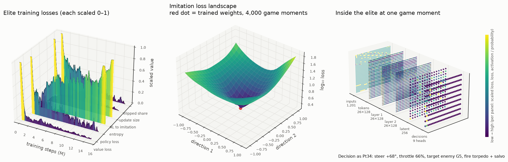

# mk48 neural-network bots: technical details

*The plain-language overview is in [README.md](README.md). This page is for programmers.*

Neural-network players for [mk48](https://github.com/SoftbearStudios/mk48), the open-source naval
combat game (AGPL-3.0), trained on a server you run yourself. You can play against them, or watch
the game through their eyes, in the real web client.

Everything runs on your machine, against the game in this repository. Nothing here connects to
mk48.io, CrazyGames or any other public server, and there is no anti-detection code of any kind.


---

## Setup (once)

From the repository root, on macOS (Apple Silicon) or Linux:

```bash
# Rust: the game pins a nightly toolchain; the web client is built with trunk.
rustup toolchain install nightly-2024-04-20 && rustup override set nightly-2024-04-20
rustup target add wasm32-unknown-unknown
cargo install --locked trunk --version 0.21.7
(cd client && trunk build --release --minify --no-sri --skip-version-check --filehash false)
(cd server && cargo build --release)   # one binary: the game server and the `train` mode

# Python 3.12 environment for the networks
cd agent
uv venv --python 3.12 .venv
uv pip install --python .venv/bin/python torch gymnasium stable-baselines3 numpy tensorboard matplotlib pytest
.venv/bin/python -m pytest -q
```

On macOS the C compiler needs the Xcode license accepted once (`sudo xcodebuild -license`).
Build the client before the server: the server embeds the built client.

## Quick start

```bash
./run_game.sh models/bc_v6.pt 12 40 models/elite_v2b_3M.pt
```

Arguments: main policy, NN bots, built-in bots, optional elite policy. Run it from this folder;
it keeps running until Ctrl+C, and refuses to start if a server is already on port 8443.

1. Open **https://localhost:8443** and click past the certificate warning (your own server uses a
   self-signed certificate).
2. Pick a name and press Play:
   - **`AI Elite`**: the elite network drives your ship and you see exactly what it sees.
   - **`AI`**: a regular NN bot drives your ship.
   - anything else: you play yourself (hold the mouse to steer, click to fire, 1–9 pick a
     weapon, R dives/surfaces a submarine, scroll to zoom).
3. NN bots are named **NN 1, NN 2, …** and the elite is **NN Elite**. The scoreboard lists
   everyone, bots included (it scrolls).

mk48 is a top-down game, so there is no first-person camera; "through its eyes" means your
browser shows the NN ship's own view.

---

## Results

Every policy is measured the same way: **fresh worlds** (everyone starts at level 1), 2 agents
plus 32 built-in bots per world, 8 worlds, 60 game-minutes each. "Score" is the game's own score
(pickups and kills) per game-minute.

| Policy | Score/min | Kills/min | Deaths/min | K/D |
|---|---|---|---|---|
| **Elite, final (15M steps, `models/elite_15M.pt`)** | **55.0 ± 3.9** | **0.81** | 0.04 | 19.0 |
| Elite at 6M steps (`models/elite_6M.pt`) | 48.0–49.5 | 0.52–0.62 | 0.02–0.04 | 13–24 |
| Elite at 10M steps | 51.1 ± 3.6 | 0.63 | 0.06 | 11.0 |
| Elite at 4M steps | 45.7–49.2 | 0.57–0.59 | 0.04 | 14–17 |
| Expert: the built-in bot's logic, played through the NN action interface | 42–59 | 0.38–0.60 | 0.09–0.12 | 4–5 |
| Imitation policy (`bc_v6`, the regular NN bots) | 33.5 ± 3.2 | 0.30 | 0.16 | 1.9 |
| Built-in bot | 23–30 | 0.11 | 0.08 | 1.3 |
| Best PPO trained from scratch (v3) | 23.9 ± 2.8 | 0.18 | 0.14 | 1.3 |
| Random actions | 3.9 ± 1.1 | 0.03 | 0.15 | 0.2 |

The final elite scores about 2× as much as the built-in bot, kills about 7× as often and dies
about half as often. The game's `NN Elite` is now the v2b elite (`models/elite_v2b_3M.pt`),
trained for the scoreboard; see [Toward the top 10%](#toward-the-top-10-the-v2b-elite). In the same test batch, 15M beat 6M on kills (0.81 vs 0.52/min) with the
same death rate.
The ± is a 95% interval within one evaluation batch; separate batches of the same policy have
varied by more than that (up to ~±5), so only same-batch comparisons are used for decisions.

All raw results: `results/evals.json` (a snapshot; new evaluations are appended to
`runs/evals.json`). Per-vehicle breakdowns and death causes:
`python evaluate.py <policy> --server ../server/target/release/server ...`.

### In the playable server

In the game the NN ships are engine bots, and the scoreboard shows each ship's *current* score,
which a death can wipe. `evaluate.py --agent-kind` reproduces that: `player` (as in training),
`bot` (bot rules, as NN bots had before the fix) or `nn-bot` (player rules, as now). It also
reports the average current score ("board score") and scoreboard position ("board rank": the
share of other ships ranked below, 100% = top, 50% = middle). Same batch per checkpoint:

| Played as… | Elite 6M: score/min, deaths/min, board rank | Elite 15M: score/min, deaths/min, board rank |
|---|---|---|
| player (training conditions) | 49.6, 0.04, 83% | 53.1, 0.05, 85% |
| engine bot, bot rules (the game before the fix) | 40.0, 0.07, 70% | 52.4, 0.07, 77% |
| engine bot, player rules (the game after the fix) | 48.2, 0.06, 78% | 51.7, 0.06, 83% |

With the game's own mix, 12 copies of the elite and 40 built-in bots per world (elite 15M):

| 12 NN + 40 bots | Score/min | Deaths/min | K/D | Board score | Board rank (first 10 min → last 10) |
|---|---|---|---|---|---|
| bot rules (before the fix) | 37.1 | 0.17 | 2.8 | 430 | 58% (47% → 60%) |
| player rules | 56.2 | 0.13 | 5.2 | 806 | 77% (50% → 86%) |
| player rules + lead aim + ship personas (the game now) | 43.2 | 0.17 | 3.4 | 541 | 68% (44% → 80%) |

Why the elite sat in the bottom half of the live scoreboard:

- **Bot rules.** Every death reset it to level 1–2, and half its respawns were at random spots,
  sometimes next to battleships. It is weakest exactly there: ~10 score/min in level-1 boats
  against 60–90 in battleships.
- **Crowding.** With 12 elite copies (built-in bots attack bots of any level, and the copies fight
  each other), deaths rose from 0.07 to 0.17/min.
- **Early game.** Even under player rules its board rank is ~45–50% in the first 10 minutes and
  climbs to 85–98% once it reaches big ships. The live scoreboard was read ~15 minutes in.

### Aiming and ship personas

Same batch, elite 15M, 2 agents + 32 bots per world, 8 worlds × 60 game-minutes. Damage is weapon
damage dealt, in boats' worth; per shot means per decision that fired.

| Elite 15M | Score/min | Kills/min | Damage/min | Damage per shot | Board rank | Time by ship family |
|---|---|---|---|---|---|---|
| aim at the target's position (before) | 53.5 | 0.75 | 1.30 | 0.096 | 85% | surface 100% |
| lead aim | 53.0 | 0.86 | 1.53 | 0.107 | 86% | surface 100% |
| lead aim + ship personas | 47.4 | 0.74 | 1.31 | 0.103 | 78% | surface 68%, submarine 24%, carrier 7%, other 1% |

Leading adds ~18% damage and ~15% kills at the same score and death rate. Personas spread the
ships over every family, with 3–6 different ships at most levels (level 8: Montana, TuoChiang,
Yasen, Zumwalt, Kirov; level 9: Yamato, Seawolf, Clemenceau), but cost ~11% score/min here and
more in the crowded game mix (board rank 77% → 68%): the elite never practised submarines and
carriers in training (Seawolf 33/min vs Yamato 63/min at level 9; the Clemenceau carrier does
well at 79/min).

### Toward the top 10% (the v2b elite)

**Target.** In the game's setup (`NN Elite` among 11 imitation NN bots and 40 built-in bots), an
average scoreboard position over an hour in the top 10% (≥ 90%). Twelve NN ships can't all be
there: the top 10% of 52 ships is 5 places, and 12 ships holding the top 12 places would still
average 89%.

**Where the 15M elite stood** (`pressure_test.py`, game conditions: NN-bot rules, lead aim,
personas with ratings): 78%, by 10-minute block 42 / 76 / 85 / 87 / 87 / 90%. It earned 62.6
points/min, but deaths wiped 25.3/min: a death keeps only about 60% of the score, while the reward
charged a flat −4 for it. Its skill audit (`skills.py`): submarines never dived (the dive
probability was about 10⁻⁶), SAMs answered 5% of the incoming missiles and aircraft they could
hit, decoys none of the closing torpedoes, and active sensors stayed on ~95% of the time in every
ship.

**What changed in training** (`ppo_entity.py`):

| Change | Why |
|---|---|
| `--reward board`: a death also costs the score it wipes (0.05 per point, at most 50 per death) | Protect the lead: bold with little to lose, careful when rich |
| `--ship-style` and 4 frozen elite copies per world (4 learners, 40 bots) | Practise every ship family and its weapons against the toughest opponents |
| `--free-heads submerge,active`, `--dive-bias 17` | Skills the starting policy never tried: no KL anchor on them, and submarines start diving 95% of the time |
| `--defense-coef 0.05` (`entity_policy.defense_labels`) | An auxiliary imitation loss shows a move PPO would never sample: a SAM at the nearest incoming missile or aircraft, a decoy against a closing torpedo or missile |
| `--doctrine-coef 0.05` (`doctrine_labels`, v4 only) | Carriers launch aircraft at ships in reach; submerged submarines keep active sonar off |
| `--world-minutes 10` | More early-game practice |
| Checkpoints chosen by pressure tests | PPO drifted: v2 was best at 1M steps and over-cautious by 4M (66 → 48 score/min); v2b's checkpoints scored 74 / 74 / 85 / 67% |
| 2–3 runs in parallel, 32 worlds each | The loop waits on the game worlds (CPU) and the GPU in turn; parallel runs kept the CPU at ~90–98% and the GPU at 55–100% |

Runs: v2 (board reward, personas, self-play, diving; 4M steps), v2b (v2 + defence lessons +
10-minute worlds; 4M), v3 (v2's 1M checkpoint + defence lessons, KL 0.05 throughout; 1.5M), v4
(v2b + aircraft and stealth lessons; 1.5M).

**Results** (fresh worlds per scenario; ranks are averages over every game-minute):

| Model | Top 10% scenario: rank (after minute 20) | Crowd rank | Hostile: rank, deaths/min | Rich start: net score/min | Skill checks |
|---|---|---|---|---|---|
| elite 15M (before) | 78% (87%) | 66% | 66%, 0.108 | 38.8 | 1/5 |
| v2 at 1M steps | 83% (92%) | 63% | 67%, 0.087 | 42.8 | 3/5 |
| v2 (4M) | 80% (89%) | 65% | 73%, 0.083 | 28.6 | 3/5 |
| **v2b at 3M (the new elite)**, two runs | **85% (93%), 85% (93%)** | 69% | **76%, 0.075** | 27.8 | **5/5** |
| v2b (4M) | 67% (79%) | 67% | 73%, 0.069 | 42.1 | 5/5 |
| v3 | 83% (90%) | 66% | 71%, 0.069 | 30.1 | 4/5 |
| v4 | 81% (90%) | **70%** | 69%, 0.100 | 29.1 | 5/5 |
| v4 at 1M steps | 84% (91%) | – | – | – | – |

**The new elite is v2b's 3M checkpoint** (`models/elite_v2b_3M.pt`): 85% in two independent runs of the top-10%
scenario, 93% after the first 20 minutes, 0.04 deaths/min against 0.087, the best hostile rank and
second-best crowd rank, and all five skill checks. Starting rich it holds first place like every
model, but nets less per minute than the old elite (27.8 vs 38.8): it fights less when ahead. Its
measured ship ratings are `ship_ratings.tsv`. **Not reached: 90% over
the whole hour.** From minute 20 it holds 90–95%, but the first 10 minutes average about 55%:
everyone starts at 0 (ties count as the middle) and small boats earn little.

**Skills, before and after** (skills scenario: every ship family, 32 ships × 30 minutes):

| | 15M (before) | v2b 3M (new elite) | v4 |
|---|---|---|---|
| submarines submerged (when threatened) | 0% (0%) | 91% (95%) | 99% (99%) |
| SAM against incoming missiles and aircraft | 5% | 63% | 94% |
| decoy against closing torpedoes and missiles | 0% | 26% | 97% |
| depth charges against submarines | 35% | 39% | 39% |
| aircraft against ships | 64% | 28% | 45% |
| active sonar while submerged | – | 93% | 1% |

v4 learned every skill best, including stealth (active sensors on: submarines 1%, carriers 26%,
surface ships 81%), and is the best in crowds, but it plays safer and scores less (top 10%: 81%).
It ships as a second style: `./run_game.sh models/elite_v4.pt 12 40 models/elite_v2b_3M.pt` gives stealthy, defensive NN bots
around an aggressive elite.

**Pressure scorecard** (`pressure_test.py --report`): the 15M elite passed 3 of 11 checks, the new
elite 8 of 11. It fails the top-10% target (85% < 90%), the crowd target (69% < 80%) and the
hostile rank target (76% < 85%).

**Lessons.** The last checkpoint isn't the best: test checkpoints and keep a firm KL anchor once a
policy is good. Exploration bonuses (the dive bias) teach a move but not its timing: v2's
submarines dived 99% of the time and stopped attacking (TypeViic 13 → 4 score/min), which the
ship ratings then steer around. Moves PPO would almost never sample (SAMs, decoys) need a
demonstration; an auxiliary imitation loss on the situation took SAM use from 5% to 87% (v2b).

### Opening book (experiment)

In a fresh world everyone starts at 0, and the elite spent its first three minutes below the middle
of the scoreboard (39 → 42 → 43%) in level-1 boats. An opening book is a second network that drives
the ship while it's small and hands over to the elite at a set level: `PhasedPolicy`, loaded from a
JSON recipe that `evaluate.py`, `pressure_test.py` and `serve_policy.py` accept like a policy file
(`{"opening": ..., "main": ..., "until_level": 5}`, paths relative to the recipe). Each network
only computes the rows it drives. Openings were trained from the elite in 6-minute worlds: A
(`--reward board`), B (`--reward opening`: score gained counts double) and C (as B with a looser KL
anchor, 0.02 → 0.01, and 2.5M steps instead of 1.5M).

The `opening` pressure scenario (the top-10% setup for its first 20 minutes, 16 worlds):

| | First 10 min | Minutes 10–20 |
|---|---|---|
| elite alone | 56% | 79% |
| A, until level 3 / 4 / 5 | 48 / 59 / 51% | 74 / 78 / 73% |
| B, until level 3 / 4 / 5 | 50 / 48 / 57% | 75 / 71 / 89% |
| C, until level 4 / 5 | 57 / **65%** | 85 / 85% |

C until level 5 confirmed its opening in the 60-minute top-10% scenario (first 10 minutes 64% and
61% against the elite's 56% and 53%), but not the hour: 85% and 84%, against the elite's 85% and 85%
(later blocks came out a little lower). It ships as an option (`models/elite_opening.json`), not as the default.
Runs of the same setup vary by about ±5 points, so only differences confirmed twice count.

---

## How the network works

### What it sees

Only what a real player's client is sent (`World::get_player_complete` on the server), encoded
as 1,201 numbers per decision:

- **Own ship (40):** health, speed, heading, position, distance to the world edge, level and
  progress to the next, submerged, which weapon types are ready, sensor ranges, own active-sensor
  setting, time since spawn, upgrade available, exact ship type.
- **24 nearest contacts × 39:** position, velocity and heading relative to the ship; kind (ship,
  weapon, aircraft, pickup, obstacle, …); exact type, or "unidentified blip" if sensors can't tell;
  friendly or not; level; altitude; weapon type; pickup value (coin 10, crate 2, barrel 1); and for
  each of 7 weapon types, *can a ready weapon hit this contact right now* (the player sees turret
  arcs and reload bars).
- **Map:** a 15×15 grid of land and border around the ship, rotated to the ship's heading.

### What it can do

Decisions are made 5 times a second, as a set of choices:

| Head | Options |
|---|---|
| Steering | 16 directions relative to the current heading |
| Throttle | 5 levels (including reverse) |
| Target | point at one of the visible contacts, or "none" |
| Fire | yes / no |
| Weapon type | torpedo, gun, missile/rocket, aircraft, depth charge/mine, SAM, decoy |
| Salvo (elite) | also fire every other ready weapon that can hit the target |
| Submerge | yes / no (submarines) |
| Active sensors | on / off (they reveal you) |
| Ship family | preferred family for upgrades and respawns (in the game, ship personas decide instead; see below) |

These are turned into the game's normal control message (heading, speed, aim point, fire weapon
N, submerge, sensors), so the network uses exactly the controls a player has. Upgrades happen as
soon as they are affordable.

### Architecture

An **entity transformer** (`entity_policy.py`):

- Every contact becomes a token (small MLP), plus one token for the own ship and one for the map
  (small CNN over the 15×15 grid). Ship types get a learned embedding, so the same network can
  play a submarine differently from a destroyer.
- 2 transformer layers (128 wide, 4 attention heads) let contacts be compared with each other,
  e.g. which ship is the threat and which is the best target.
- One categorical head per decision; the **target head is a pointer**: it scores each contact
  token directly, so aiming is "pick a ship" rather than regressing coordinates.
- A separate value network with the same shape is used for PPO.



Left: the elite's training losses. Middle: the imitation network's loss over a 2D slice of weight
space; the trained weights sit at the bottom of the bowl. Right: every neuron of the elite at one
real game moment, from the 1,201 inputs through the token embeddings, both transformer layers and
the latent vector to the 9 decision heads (here: torpedo an enemy with a salvo).

### Rules outside the network

The network makes the decisions; a few fixed rules sit around it:

- **Collision guard** (`agent_commands` in `../server/src/train.rs`): if the ship touches an
  oil platform or land, or its commanded course would hit an obstacle, land or the world border
  within ~2 s, it takes the clear heading closest to what the network wanted. Oil platforms kill
  after ~6 s of contact; the network saw them in every case and still pushed in (a habit copied
  from the built-in bot). Same checkpoint, before the guard and with its final version:
  navigation deaths 81 → 3, deaths/min 0.15 → 0.04, K/D 3.1 → 14.1.
- **Aim snapping and lead** (`lead_point` in `../server/src/train.rs`): the aim point snaps to a
  visible enemy within 15% of sensor range, like clicking on a ship rather than beside it, and then
  moves to where that ship will be when the weapon arrives (its speed and heading, the chosen
  weapon's speed and range). Guns, rockets and straight-running torpedoes go where the aim point
  was at launch, and homing weapons only search a cone around their launch direction, so aiming at
  the ship's current position missed moving targets (the built-in bot does that too, and the
  network learned it from the bot). Turrets also turn toward the lead point while the network
  waits to fire. `--no-lead` turns it off for comparison.
- **Ship personas** (`ShipPrefs` in `../server/src/train.rs`, on for every NN ship in the game,
  `--ship-style` in training/evaluation): each life draws a weight per ship family (submarine,
  surface, carrier, other) times a weight per ship, and every upgrade and respawn takes the
  best-weighted option. The network's own family head always chose surface ships (the elite never
  drove a submarine or carrier in 60 game-minutes × 16 ships), so every NN ship followed nearly
  the same upgrade path. With personas each ship takes its own path: a submarine captain, a
  carrier admiral, a destroyer captain, … and fights accordingly.
- **Weak ships avoided:** NN bots don't pick the Olympias (ram), Dredger, Lublin (minelayer, whose
  mines drop behind it) or Tanker. They came last at their level in every evaluation and took
  ~23% of the elite's time.
- **Player rules for NN bots** (`nn_driven` in `../server/src/player.rs`): in the playable
  server the NN ships are engine bots, and bots normally play by harsher rules: a death resets
  their score to level 1–2, half their spawns are at random spots, and the search for a safe
  spawn spot is shorter. NN bots play by player rules instead, as in training. Built-in bots still
  treat them as bots and attack them at any level. See [In the playable server](#in-the-playable-server).

---

## How it was trained

### 1. A headless training world (fast simulation)

`server train` (`../server/src/train.rs`) runs the real game world with N network-controlled
ships and built-in bots, with no networking and no wall clock: about **18,000 agent-steps per
second per process**, versus ~10 for a bot playing through a browser. Python talks to it over
pipes (`mk48env.py`, a vectorized Gymnasium/Stable-Baselines3-style environment).

- One episode is one life; worlds restart every 30 game-minutes (staggered) so training keeps
  covering the early game.
- Reward is a weighted sum of score gained, kills, death, damage taken and damage dealt, and every
  part is logged separately.

### 2. Imitation of the built-in bot (DAgger)

Reinforcement learning from scratch plateaued below the built-in bot, so the network first learns
to copy it (`train_bc_entity.py`):

- Each NN ship has a "shadow" copy of the built-in bot. Every step the server asks the shadow what
  it would do *from that ship's exact view* and sends that as the label.
- Round 1 follows the bot; later rounds follow the network while still collecting the bot's
  labels, so it also learns to recover from its own mistakes (DAgger). 10 rounds, ~640k samples.
- The bot fires randomly even when it has a shot; the labels use its *firing solution* instead
  ("a ready weapon can hit this target"), which is learnable.

Result: `bc_v6`, 33.5 score/min. That's above the built-in bot, but below the bot's own logic played
through the NN interface (the "expert", 42–59).

### 3. Reinforcement learning from the imitation policy (PPO)

`ppo_entity.py`, a custom PPO on the GPU (fp16):

- Starts from the imitation weights. The value network is trained alone for the first 0.5M steps.
- A KL penalty keeps the policy close to the imitation policy, fading over the run. Without it,
  fine-tuning wiped out the imitated combat skills within a few million steps (v4: 28 → 18).
- Exploration samples from the discrete choices instead of adding noise to aim and trigger.

### 4. The elite

The elite is trained like step 3, with:

- an **aggressive reward**: damage dealt +2 per ship's worth, kill +3, death −4, damage taken −1.5;
- the **salvo** action (several weapons at once);
- **frozen NN opponents**: each world has 4 learning agents, 2 frozen copies of the imitation
  policy and 32 built-in bots;
- a looser KL anchor (0.1 → 0.01) so it can develop its own style;
- the v5 PPO policy as its starting point.

Checkpoints are evaluated and swapped into the game only when they win a same-batch comparison
(4M → 6M: deaths halved, K/D 16.7 → 24.3; 10M tied 6M; the final 15M beat 6M with 56% more
kills at the same death rate). Late in the run the policy drifted far from the imitation anchor
(KL ≈ 1.1 at 15M), so it developed its own, more aggressive style.

---

## What didn't work (and what it taught)

| Attempt | What happened | Lesson / fix |
|---|---|---|
| v1: PPO, MLP, 16 learning agents per world | 50+ score/min in training, 19.6 in fresh worlds | Agents farmed each other. Evaluate in bot-dominated **fresh** worlds only. |
| v2: same, 4 agents per world, worlds never restart | Got *worse* in fresh worlds (13.9) | It overfit to long-running worlds and lost the early game. Restart worlds every 30 min. |
| Running the small MLP on the GPU | ~2× slower than CPU | GPU pays off only with the transformer. |
| Imitation with an MLP and averaged (MSE) outputs | 21–25 score/min, rarely hit anything | Averaging "aim at ship A or B" or "turn left or right" gives a bad answer. Use discrete heads and a target pointer. |
| Copying the bot's trigger pulls | Never learned to fire | The bot fires at random; label its firing solution instead. |
| v4: PPO from imitation, no anchor | 28 → 18 score/min, K/D 0.95 → 0.26 | Add a KL anchor and value warm-up (v5, elite). |
| Elite before the guard | ~40% of deaths from oil platforms | The platform was always visible; added the collision guard. |
| First guard versions | Fixed platforms, but ships ran onto land / off the map | Check the whole hull and the path, not just the centerline. |

---

## Files

| File | What it does |
|---|---|
| `../server/src/train.rs` | Headless training mode, observation/action encoding, expert labels, collision guard, lead aim, ship personas, `--agent-kind`, scoreboard rank |
| `../server/src/nn_bots.rs` | NN control of engine bots and `AI…` autopilot players in the normal server |
| `../server/src/player.rs` | `nn_driven` / `has_bot_rules`: NN bots play by player rules (used in `world_mutation.rs`, `world_inbound.rs`, `world_spawn.rs`, and `bot.rs`, whose bots spare small NN bots as they spare small players) |
| `../server/src/bot.rs` | Built-in bot (now also exposes its firing solution for labels) |
| `../server/src/world_mutation.rs` | Damage-dealt statistic used by the elite reward |
| `../server/src/server.rs` | Scoreboard shows everyone (`LEADERBOARD_SIZE`, `LIVEBOARD_BOTS`); NN hooks |
| `../vendor/kodiak` | Local copy of the game engine; the client's 10-row scoreboard limit raised |
| `mk48env.py` | Vectorized environment, rewards, world restarts |
| `entity_policy.py` | Entity-transformer policy, action/label conversion, save/load, lessons (`defense_labels`, `doctrine_labels`), opening-book recipes (`PhasedPolicy`) |
| `train_bc_entity.py` | Imitation (DAgger) |
| `ppo_entity.py` | PPO with KL anchor, fp16, frozen opponents, reward presets |
| `evaluate.py` | Fresh-world evaluation, per-vehicle stats, death causes, damage per shot, scoreboard score and rank, score lost to deaths, time per ship family; `--agent-kind`, `--ship-style`, `--ship-ratings`, `--no-lead`, `--opponents`, `--start-score`, `--bot-aggression`, `--skills` |
| `skills.py` | Skill audit (`evaluate.py --skills`): per weapon class, how often it answers the situations that weapon exists for; diving, sensors, damage taken per ship family; target choice |
| `pressure_test.py` | Pressure tests: hard scenarios with pass/fail targets, run as parallel processes (`runs/pressure/`) |
| `ship_ratings.py` | Ship ratings (score/min per ship for a policy) for personas; the game server reads `ship_ratings.tsv` |
| `tests/test_server_rules.py` | Runs `server self-test` (lead aim, personas, player rules for NN bots) and checks the score-lost info |
| `serve_policy.py` | Runs main + elite policies for the game server |
| `plot_training.py` | 3D viridis chart (`runs/training.png`) and 2D chart |
| `plot_nn_3d.py` | 3D views of the networks: training losses, loss landscape, the elite's neurons at one game moment |
| `run_game.sh` | Starts the playable server with NN bots |
| `models/` | Trained networks: `bc_v6.pt` (imitation), `ppo_v5.pt`, `elite_6M.pt`, `elite_15M.pt`, `elite_v2b_3M.pt` (the current elite), `elite_v4.pt` (best skills; a second style), `opening_c.pt` with `elite_opening.json` (opening book: opening_c until level 5, then the elite) |
| `ship_ratings.tsv` | The current elite's ship ratings, read by the game server through `run_game.sh` |
| `results/` | Evaluation results (`evals.json`), pressure-test results (`pressure/`) and charts |
| `train_ppo.py`, `train_bc.py` | Earlier Stable-Baselines3 MLP versions (v1–v4), kept for reference |

One server build (`server/target`) serves both the game and training (`server train`). The
networks in `models/` were trained during development against intermediate builds; `bc_v6.pt` and
`ppo_v5.pt` use the earlier 9-action interface, and the game server and `evaluate.py` pad their
actions (no salvo), so they run as-is.

---

## Reproduce

After Setup, from this folder:

```bash
.venv/bin/python train_bc_entity.py --device mps                          # -> runs/bc_v7
.venv/bin/python ppo_entity.py --init runs/bc_v7/policy.pt --steps 10000000 --run ppo_v5
.venv/bin/python ppo_entity.py --init runs/ppo_v5/policy.pt --reward aggressive \
    --opponents 2 --opponent-policy runs/bc_v7/policy.pt --kl-start 0.1 --kl-end 0.01 \
    --steps 15000000 --run ppo_elite
.venv/bin/python evaluate.py runs/ppo_elite/policy.pt --server ../server/target/release/server \
    --device mps --agents 2 --bots 32 --procs 8 --minutes 60 --save "elite"
.venv/bin/python evaluate.py models/elite_15M.pt --device mps --agents 12 --bots 40 --procs 4 \
    --minutes 60 --agent-kind nn-bot --ship-style   # as in the game: 12 NN bots + 40 built-in bots
.venv/bin/python ppo_entity.py --init models/elite_15M.pt --reward board --ship-style --agents 4 --bots 40 \
    --opponents 4 --opponent-policy models/elite_15M.pt --kl-start 0.05 --kl-end 0.01 --world-minutes 10 \
    --procs 32 --steps 4000000 --free-heads submerge,active --dive-bias 17 --defense-coef 0.05 --run ppo_elite2b
.venv/bin/python pressure_test.py models/elite_v2b_3M.pt --ratings ship_ratings.tsv --label "new elite"   # scorecard
.venv/bin/python plot_training.py
.venv/bin/python -m pytest -q
```

Ctrl+C or SIGTERM during training saves the model and exits. Checkpoints are written every 1M steps.

Training from this source uses the 10-action interface (with salvo). The shipped `bc_v6` and
`ppo_v5` models predate it (9 actions); the elite was upgraded from 9 to 10 actions when its
training started.

---

## Limitations and next steps

- **Navigation is partly scripted.** The collision guard is a fixed rule. A future version could
  learn avoidance itself, for example with a contact penalty and an "about to collide" input.
- **No memory.** The network reacts to the current view. A recurrent layer (GRU/LSTM) would help
  it track ships that dive or move out of view.
- **Opponents are bots and frozen copies.** A league of past elite versions (self-play) would make
  it more robust against human tactics.
- **Ship choice is random, not learned:** personas give variety, and weak ships are excluded, but
  the network doesn't pick the ship that suits it, and it plays submarines and carriers worse than
  surface ships because it never practised them (personas cost ~11% score/min). Fine-tuning with
  `--ship-style` on would let it practise every family; learning the exact upgrade would let it
  pick, say, the Kolkata on purpose.
- **One playing style:** different ships fight differently, but the decisions come from one
  network. Distinct learned strategies (an ambusher, a hunter, a collector) need separate or
  style-conditioned training runs (each ~4 h on this machine).
- **Not done: playing from screen pixels.** The original plan's last step is a vision network that
  plays through the browser from screenshots. Here, a pixel network would learn by copying this
  state-based policy (teacher → student).
